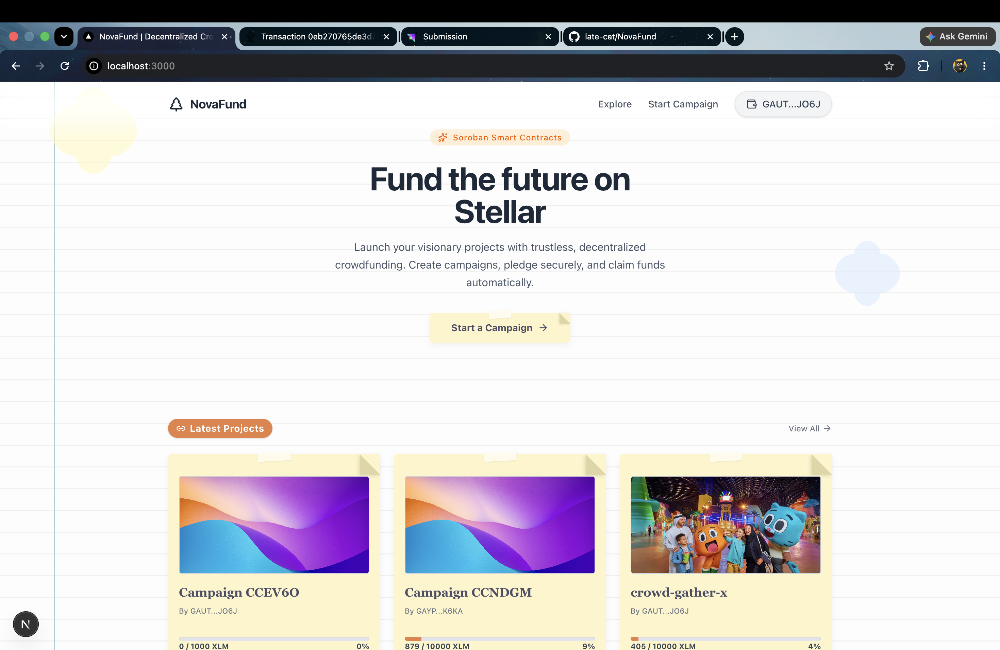
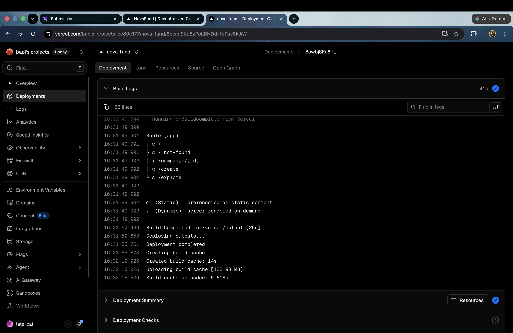
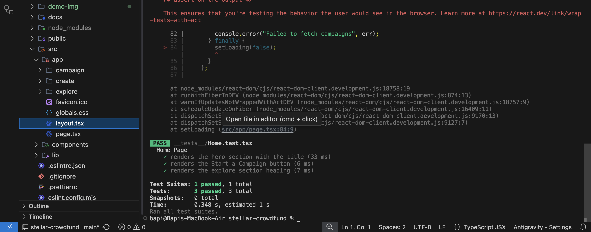
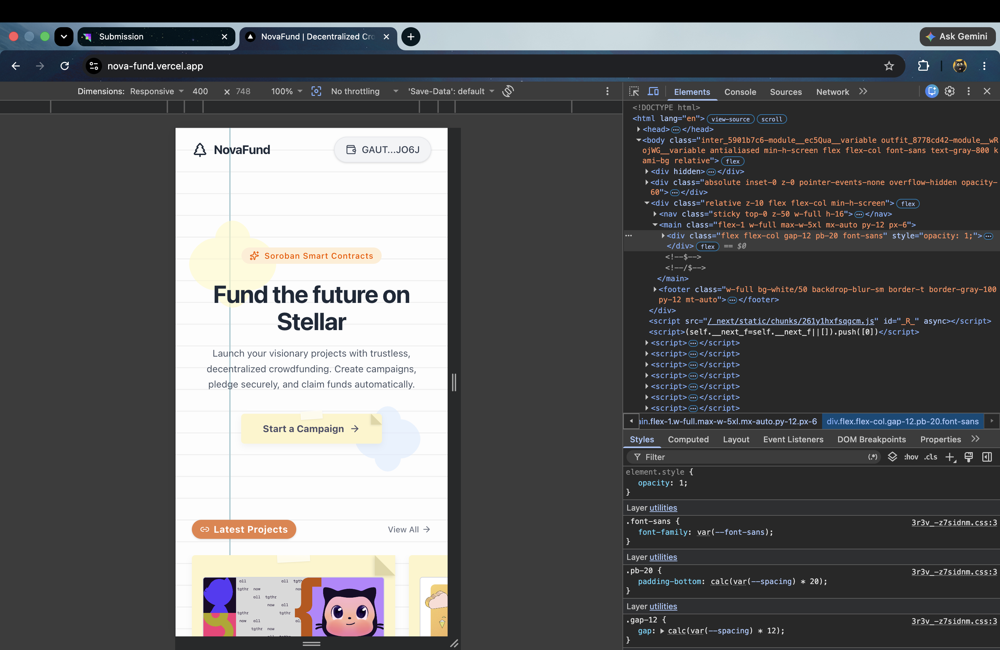
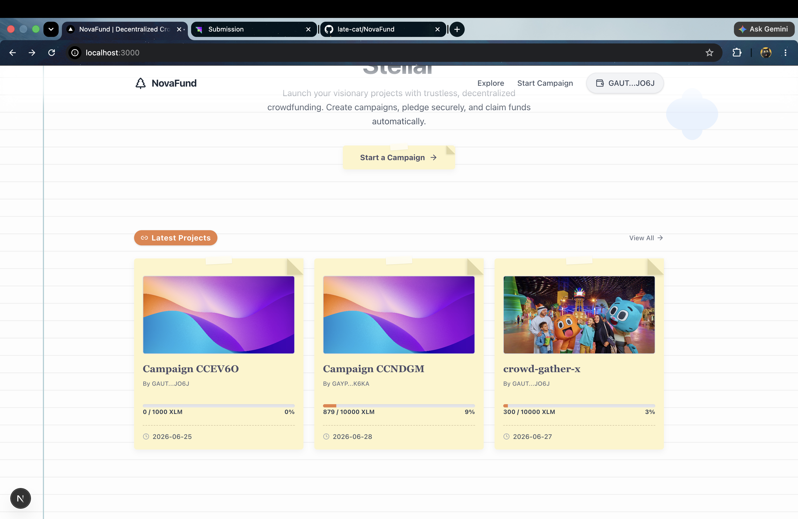
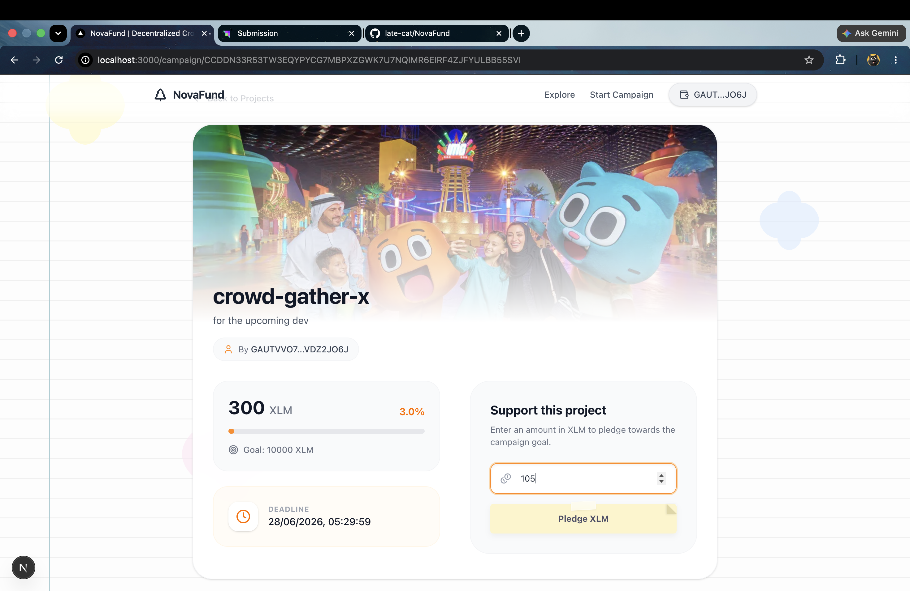
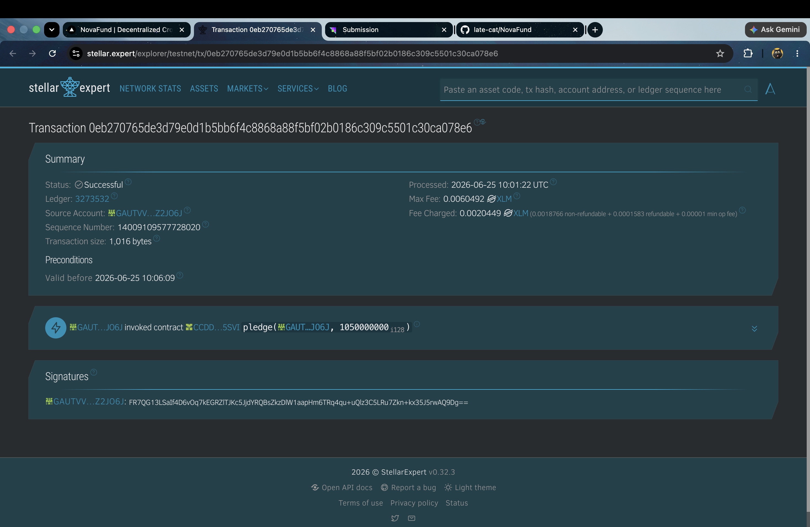

<div align="center">
  
  <h1 align="center">NovaFund: Decentralized Crowdfunding</h1>
  
  <p align="center">
    <strong>A next-generation trustless crowdfunding platform powered by Soroban Smart Contracts on Stellar.</strong>
  </p>

  <h3>🚀 Live Demo: <a href="https://nova-fund.vercel.app/">https://nova-fund.vercel.app/</a></h3>
  <h3>🎥 Demo Video: <a href="https://youtu.be/S9shZimBqp4">Watch on YouTube</a></h3>

  <p align="center">
    <a href="#challenge-requirements-fulfilled">Belt Challenge Submission</a> •
    <a href="#smart-contract-information">View Contracts</a> •
    <a href="#local-setup-instructions">Get Started</a>
  </p>
</div>

---

## Project Description

NovaFund is a modern, decentralized crowdfunding application built to demonstrate the powerful capabilities of the Stellar network and Soroban Smart Contracts. By combining a Next.js App Router frontend with custom Soroban factory and campaign contracts on the Stellar Testnet, users can seamlessly connect their Freighter wallets, deploy fully autonomous fundraising campaigns, and pledge XLM natively and securely.

## Key Features

- **Multi-wallet Integration:** Securely connect and manage sessions using Freighter and Stellar APIs.
- **Factory Pattern Deployment:** Deploy unlimited independent campaign contracts using a core Factory Smart Contract.
- **On-chain Pledging:** Pledges are securely transferred on the Stellar Testnet using the Soroban native token interface.
- **Dynamic Metadata Storage:** Seamless local storage syncing to bridge decentralized contract instances with rich frontend UX.
- **Premium UX/UI:** Fluid, fully responsive, and heavily stylized components with micro-animations powered by Tailwind CSS and Framer Motion.
- **End-to-End Transparency:** Integrated transaction explorer links for total visibility into the underlying blockchain movements.

## Challenge Requirements Fulfilled

This project serves as a comprehensive submission for the Stellar developer challenge, fulfilling all core criteria:

- [x] **Smart Contract Deployment:** Custom Soroban Factory and Campaign contracts successfully deployed to Testnet.
- [x] **Contract Interaction:** Frontend dynamically parses inputs, signs transactions, and invokes contract functionality (create campaign, pledge).
- [x] **Transaction Status Visibility:** Provides explicit alerts, clear UI updates, and links to the Stellar Expert block explorer.
- [x] **Meaningful Commit History:** Over 20+ professional, semantic commits showcasing steady, iterative progress.
- [x] **Comprehensive Error Handling:** Captures edge cases, specifically mapping `Error(Contract, #10)` to readable "Insufficient Funds" warnings instead of crashing the UI.
- [x] **Mobile Responsiveness:** Deeply optimized UI architecture utilizing `md:` media queries for flawless phone and tablet layout.

## Visual Walkthrough

### CI/CD Pipeline & Automated Testing



### Mobile Responsive UI


### Exploring Ongoing Campaigns


### Starting a New Campaign


### Pledging and Confirming Transaction



### On-Chain Transaction Success


## Architecture Overview

The application utilizes a robust dApp architecture:
1. **Frontend Layer (Next.js 14):** Handles the App Router logic, state management, and wallet integrations.
2. **Integration Layer (Stellar SDK/Soroban Client):** Houses the auto-generated TS bindings for our Soroban smart contracts, facilitating seamless typed calls.
3. **Smart Contract Layer (Soroban Rust):** Acts as the immutable escrow and state manager.

## Smart Contract Information

NovaFund utilizes a Factory pattern. The core factory contract is deployed on the test network:

| Property | Value |
| :--- | :--- |
| **Network** | Stellar Testnet |
| **Factory Contract Address** | `CBGNLTWENII3LYUUVFU7DKCXV4HQTEKJQEUWXJKVIMVNMQL7E2DP2MEM` |
| **Environment** | Soroban Environment |

## Project Structure

```text
stellar-crowdfund/
├── src/
│   ├── app/           # Next.js App Router pages and global CSS
│   ├── components/    # Reusable UI elements (Navbar, Cards, Wallet Connect)
│   └── lib/           # Soroban TS client bindings and Stellar utilities
├── contracts/         # Soroban Rust smart contract source code (factory, campaign)
└── package.json       # Project dependencies and scripts
```

## Local Setup Instructions

To run this application locally, ensure you have Node.js (v18+) installed, then execute:

```bash
# Install all dependencies
npm install

# Start the development server
npm run dev
```
Navigate to `http://localhost:3000` to interact with the application.

## Technology Stack

- **Framework:** Next.js (React)
- **Language:** TypeScript, Rust (Contracts)
- **Styling:** Tailwind CSS
- **Animation:** Framer Motion
- **Web3 Integration:** Stellar Freighter API, Soroban CLI Bindings
- **Network:** Stellar Testnet

## Error Handling

The application has been engineered to handle critical edge cases gracefully:

1. **Wallet Not Installed:** Gracefully catches wallet connection attempts when Freighter is missing.
2. **User Rejects Transaction:** Safely catches wallet declination errors.
3. **Insufficient Balance:** Specifically captures and notifies users when attempting to pledge beyond their available liquid XLM balance.

## Deployment Information

This project is optimized for deployment on Vercel. Since it operates entirely as a decentralized application interacting directly with the Stellar Testnet, the Next.js frontend can be deployed statically with zero backend infrastructure required.

 
  
