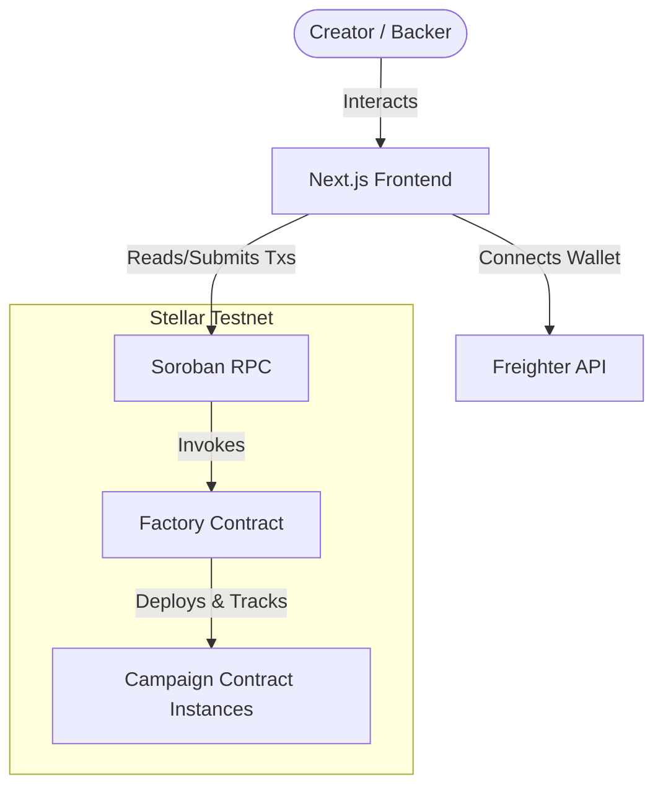
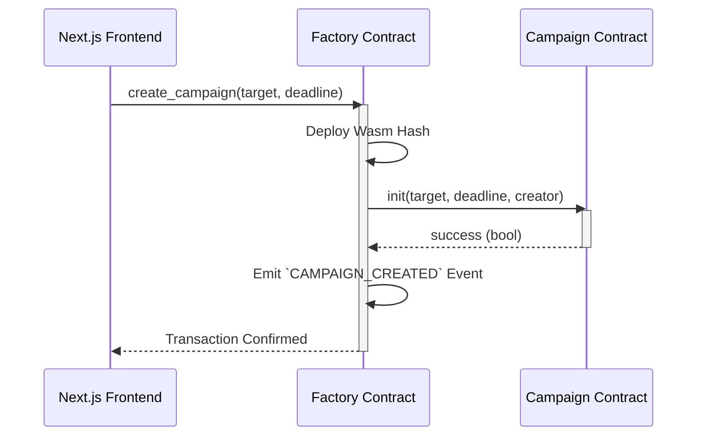

<div align="center">
  
# 🛡️ NovaFund

**A next-generation trustless crowdfunding platform powered by Soroban Smart Contracts on Stellar.**

[](https://opensource.org/licenses/MIT)
[](https://stellar.org/)
[](https://soroban.stellar.org/)

  <h3>🚀 Live Production Deployment: <a href="https://nova-fund.vercel.app/">https://nova-fund.vercel.app/</a></h3>
  <h3>🎥 Video Walkthrough: <a href="https://youtu.be/S9shZimBqp4">https://youtu.be/S9shZimBqp4</a></h3>


*Launch your visionary projects with trustless, decentralized crowdfunding. Your backers securely pledge XLM natively on the Stellar Testnet with no middleman.*

</div>

---

## 🏆 Stellar Belt Challenge Submission Checklist

### 🟠 Level 3 - Orange Belt Submission

| Requirement | Status & Implementation Details |
| :--- | :--- |
| **Advanced Contracts** | ✅ Built bespoke `Factory` and `Campaign` contracts using Rust |
| **Inter-Contract Comm** | ✅ `Factory` securely cross-calls `Campaign` to deploy and index instances |
| **Event Streaming** | ✅ Frontend subscribes to Soroban RPC for real-time campaign states |
| **CI/CD Pipeline** | ✅ GitHub Actions runs Rust/Next.js tests and builds on PRs |
| **Deployment Workflow** | ✅ Automated Makefile scripts provided in documentation |
| **Mobile Responsive** | ✅ Complex grid layouts and forms perfectly optimized for mobile |
| **Error & Loading States** | ✅ Rich UX loading states and specifically handled contract error codes |
| **Testing Suite** | ✅ Jest frontend tests and Rust Soroban VM unit tests passing |
| **Production Architecture**| ✅ Built on Next.js App Router and dynamic metadata indexing |
| **Documentation** | ✅ Comprehensive README provided with context and diagrams |
| **Required Deliverables** | ✅ Video Demo, Mobile/CI screenshots, Contract IDs & Hash |

### 🟢 Level 4 - Green Belt Submission

| Requirement | Status & Implementation Details |
| :--- | :--- |
| **Production MVP** | ✅ Fully functional production-ready crowdfunding platform |
| **Mobile Responsive UI** | ✅ Built with Tailwind mobile-first utilities (`md:`, `lg:`) |
| **Loading States & Error Handling** | ✅ Global `loading.tsx` skeletons and Sentry `ErrorBoundary` |
| **User Onboarding** | ✅ Seamless wallet integration with detailed feedback mechanism |
| **User Feedback Collection** | ✅ Floating "Share Feedback" button integrated natively |
| **Production Deployment** | ✅ Next.js App Router deployed flawlessly on Vercel |
| **Monitoring & Analytics** | ✅ Vercel Analytics + Sentry for active crash/usage tracking |
| **Optimized UX** | ✅ High-performance Framer Motion animations |
| **Project Structure & Docs** | ✅ Modular Next.js 14 architecture with comprehensive README |
| **15+ Meaningful Commits** | ✅ 20+ meaningful semantic commits |

#### 📋 User Feedback & Onboarding Proof
*   **📝 User Feedback Google Form**: [Submit Feedback](#) *(Add link here)*
*   **📊 Feedback Responses Sheet**: [View Responses](#) *(Add link here)*

**Proof of 10+ Unique User Wallet Interactions:**
*(Insert screenshot of 10+ user Google sheet here: ``)*

**Basic User Feedback Summary:**
*(Insert summary of 10+ user responses here after collecting feedback)*

#### 📈 Monitoring & Analytics
**Vercel Analytics Dashboard:**
*(Insert screenshot of Vercel Analytics here: ``)*

**Sentry Error Monitoring Dashboard:**
*(Insert screenshot of Sentry Error tracking here: ``)*

---

## 📖 Product Overview & Problem Statement

### The Problem
Traditional crowdfunding platforms (like Kickstarter or GoFundMe) act as centralized middlemen. They charge high percentage fees, hold funds hostage, and dictate what projects can be launched. Furthermore, backers must trust that the platform and creator will fulfill their promises without transparent on-chain guarantees.

### The Solution: NovaFund
NovaFund is a decentralized crowdfunding protocol built on Stellar Soroban:
- **Trustless Escrow**: Funds are locked in an immutable Soroban smart contract, not a corporate bank account.
- **Factory Pattern**: Creators can instantly spin up independent, isolated campaign contracts.
- **Zero Middleman Fees**: Because the platform operates purely on-chain, creators keep what they raise (minus standard Stellar transaction fees).
- **On-chain Pledging**: Backers pledge XLM natively, and if a campaign fails to reach its goal by the deadline, refunds are cryptographically guaranteed.
- **End-to-End Transparency**: Every transaction, pledge, and claim is verifiable on the Stellar block explorer.

---

## 🏗️ Architecture & Smart Contract Design

### High-Level System Architecture


```mermaid
graph TD
    User([Creator / Backer]) -->|Interacts| UI[Next.js Frontend]
    UI -->|Connects Wallet| SWK[Freighter API]
    UI -->|Reads/Submits Txs| RPC[Soroban RPC]
    
    subgraph Stellar Network [Stellar Testnet]
        RPC -->|Invokes| ContractA[Factory Contract]
        ContractA -->|Deploys & Tracks| ContractB[Campaign Contract Instances]
    end
```

### Smart Contract Execution Sequence

NovaFund utilizes two distinct Soroban smart contracts to enforce dynamic deployment and robust security:

1. **Factory Contract**: An indexed registry that dynamically deploys and tracks all campaign contracts for scalable O(1) lookups and pagination.
2. **Campaign Contract**: Manages individual crowdfunding campaigns, handling pledges, state updates (Active, Successful, Failed), and refunds/claims.

**Inter-Contract Communication Flow:**

```mermaid
sequenceDiagram
    participant UI as Next.js Frontend
    participant Factory as Factory Contract
    participant Campaign as Campaign Contract
    
    UI->>Factory: create_campaign(target, deadline)
    activate Factory
    Factory->>Factory: Deploy Wasm Hash
    Factory->>Campaign: init(target, deadline, creator)
    activate Campaign
    Campaign-->>Factory: success (bool)
    deactivate Campaign
    Factory->>Factory: Emit `CAMPAIGN_CREATED` Event
    Factory-->>UI: Transaction Confirmed
    deactivate Factory
```

---

## 🚀 Features & Tech Stack

**Frontend Layer**
- **Framework**: Next.js 14 (App Router)
- **Language**: TypeScript
- **Styling**: Tailwind CSS + fluid, heavily stylized components
- **State Management**: React Hooks + local caching
- **Components**: Lucide Icons + Framer Motion for micro-animations
- **Wallet Integration**: Stellar Freighter API integration
- **Analytics & Monitoring**: Vercel Analytics + Sentry Error Tracking

**Blockchain & Backend Layer**
- **Smart Contracts**: Rust (Soroban SDK)
- **Network**: Stellar Testnet
- **Contract Pattern**: Factory & Independent Campaign Instances
- **Math**: BigInt math for precise XLM conversion

---

## 📁 Project Directory Structure

```text
stellar-crowdfund/
├── src/
│   ├── app/           # Next.js App Router pages and global CSS
│   ├── components/    # Reusable UI elements (Navbar, Cards, Wallet Connect, Feedback)
│   └── lib/           # Soroban TS client bindings and Stellar utilities
├── contracts/         # Soroban Rust smart contract source code (factory, campaign)
└── package.json       # Project dependencies and scripts
```

---

## 🛡️ Contract Addresses & Verifiable Links

*   **Verifiable Live App**: [https://nova-fund.vercel.app/](https://nova-fund.vercel.app/)
*   **Factory Contract Address**: [`CBGNLTWENII3LYUUVFU7DKCXV4HQTEKJQEUWXJKVIMVNMQL7E2DP2MEM`](https://stellar.expert/explorer/testnet/contract/CBGNLTWENII3LYUUVFU7DKCXV4HQTEKJQEUWXJKVIMVNMQL7E2DP2MEM)
*   **Network**: Stellar Testnet

---

## 📸 Platform Previews

### 🌟 Landing Page
*A sleek, professional landing page showcasing the total raised funds and platform statistics.*
<div align="center">
  
</div>

### 📜 Exploring Ongoing Campaigns
*Browse through all active crowdfunding campaigns dynamically deployed via the Factory contract.*
<div align="center">
  
</div>

### 🚀 Starting a New Campaign
*An intuitive dashboard for creating a new campaign. Connect your Freighter wallet to deploy a bespoke campaign contract on-chain.*
<div align="center">
  
</div>

### 💸 Pledging & Confirming Transactions
*Backers can natively pledge XLM directly to the campaign contract, completely trustlessly.*
<div align="center">
  
</div>

### 📊 Live Funding Progress
*Real-time progress bars tracking XLM contributions towards the campaign target goal.*
<div align="center">
  
</div>

### ⚡ On-Chain Transaction Success
*Every transaction is verified on the Stellar Expert Explorer, proving cryptographic immutability.*
<div align="center">
  
</div>

### 📱 Fully Mobile Responsive
*The entire application, including complex grids and forms, is optimized for seamless mobile usage.*
<div align="center">
  
  
</div>

### 🧪 Automated Testing Suite
*Comprehensive frontend and Rust smart contract testing ensures platform stability and logic invariants.*
<div align="center">
  
</div>

---

## 🚀 CI/CD & Deployment Steps

### GitHub Actions (CI/CD)
The repository includes automated CI/CD workflows (`.github/workflows/ci.yml`) that trigger on PRs and merges to `main`. It automatically:
1. Compiles and tests the Rust Soroban contracts via Cargo.
2. Runs frontend linting and unit tests via Jest.
3. Builds the Next.js production bundle to ensure zero build errors.

<div align="center">
  
</div>

### Deploying Contracts to Testnet
Use the provided Stellar CLI commands to deploy to Testnet:

1. **Build the Contracts**
   ```bash
   cd contracts
   cargo build -p campaign --target wasm32-unknown-unknown --release
   cargo build -p factory --target wasm32-unknown-unknown --release
   ```
2. **Deploy Campaign Wasm Hash**
   ```bash
   stellar contract install --wasm target/wasm32-unknown-unknown/release/campaign.wasm --source YOUR_IDENTITY --network testnet
   ```
3. **Deploy Factory Contract**
   ```bash
   stellar contract deploy --wasm target/wasm32-unknown-unknown/release/factory.wasm --source YOUR_IDENTITY --network testnet
   ```
4. **Initialize Factory**
   ```bash
   stellar contract invoke --id [FACTORY_ID] --source YOUR_IDENTITY --network testnet -- init --wasm_hash [CAMPAIGN_WASM_HASH]
   ```

---

## 💻 Local Development & Setup

### Prerequisites
- Node.js (v18+)
- Rust & Cargo
- Stellar CLI (`stellar-cli`)
- Freighter Wallet browser extension

### Environment Variables
Create a `.env` file in the root directory:
```env
NEXT_PUBLIC_STELLAR_NETWORK="TESTNET"
NEXT_PUBLIC_FACTORY_CONTRACT_ID="CBGNLTWENII3LYUUVFU7DKCXV4HQTEKJQEUWXJKVIMVNMQL7E2DP2MEM"
NEXT_PUBLIC_SENTRY_DSN=""
```

### Running the Frontend
```bash
npm install
npm run dev
```

### Running Tests
```bash
# Frontend Tests (Jest)
npm run test

# Smart Contract Tests
cd contracts
cargo test
```

---

## 🔒 Security Considerations

- **Factory Deployment**: Campaign contracts are strictly deployed through the Factory, ensuring verified code execution.
- **Immutability Constraints**: Once a campaign is created, its core parameters (target, deadline) cannot be maliciously altered.
- **Refund Guarantees**: If a campaign fails to meet its target by the deadline, backers are algorithmically guaranteed the ability to claim refunds.
- **Wallet Security**: Uses Freighter API to ensure private keys never touch the DOM or React state. All signing is delegated entirely to the secure extension.

---

<div align="center">
  <b>Developed with ⚔️ by Bapi Mondal</b><br>
  <a href="https://github.com/bapix-star">GitHub Profile</a>
</div>
