<div align="center">
  
# 🛡️ NovaFund 

**A next-generation trustless crowdfunding platform powered by Soroban Smart Contracts on Stellar.**

[](https://github.com/late-cat/NovaFund/actions)
[](https://opensource.org/licenses/MIT)
[](https://stellar.org/)
[](https://soroban.stellar.org/)

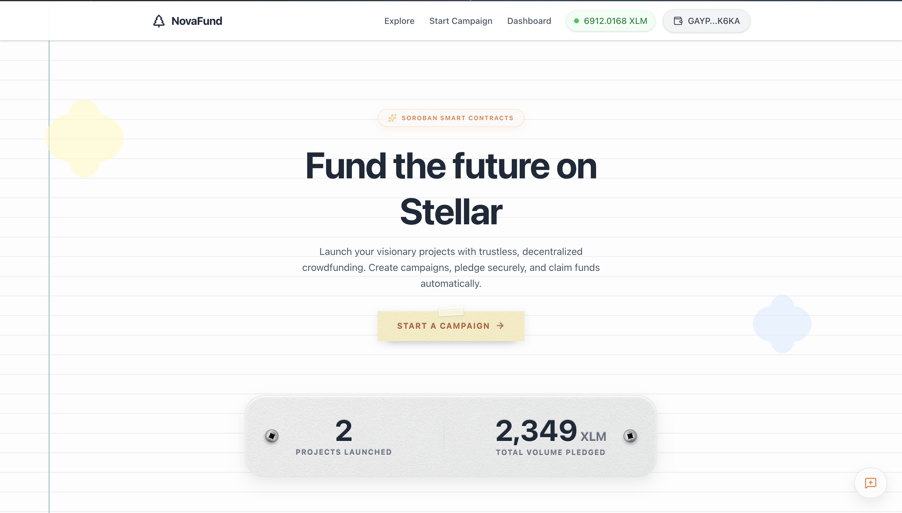

*Launch your visionary projects with trustless, decentralized crowdfunding. Your backers securely pledge XLM natively on the Stellar Testnet with no middleman.*

</div>

---

## 📌 Submission Details & Quick Links

*   **🌐 Live Production Link**: [https://nova-fund.vercel.app/](https://nova-fund.vercel.app/)
*   **📹 Demo Video Presentation**: [https://youtu.be/S9shZimBqp4](https://youtu.be/S9shZimBqp4)
*   **💻 GitHub Repository**: [https://github.com/late-cat/NovaFund](https://github.com/late-cat/NovaFund)
*   **📝 User Feedback Google Form**: [Submit Feedback](https://docs.google.com/forms/d/e/1FAIpQLSfTpOUdr3LiZeptohHgR6_YX0gLMQhNB4Uup9u3NsegC8GVDQ/viewform?usp=header)
*   **📊 Feedback Responses Sheet**: [View Responses](https://docs.google.com/spreadsheets/d/1NDniKpQd5IIiSAZ34QzRvUT7drhEgtL7Ve1rGuMKktY/edit?usp=sharing)

---

## 📖 The Vision: Problem & Solution

### The Problem
Traditional crowdfunding platforms (like Kickstarter or GoFundMe) act as centralized middlemen:
1. **High Fees**: They charge high percentage fees and hold funds hostage.
2. **Lack of Transparency**: Backers must trust that the platform and creator will fulfill their promises without transparent guarantees.
3. **Gatekeeping**: Centralized authorities dictate what projects can or cannot be launched.

### The Solution: NovaFund
NovaFund solves this by introducing a fully decentralized, smart-contract-driven escrow environment:
- **Trustless Escrow**: Funds are locked in an immutable Soroban smart contract, not a corporate bank account.
- **Factory Pattern**: Creators instantly spin up independent, isolated campaign contracts.
- **Zero Middleman Fees**: Because the platform operates purely on-chain, creators keep what they raise (minus standard Stellar network fees).
- **On-chain Pledging & Guaranteed Refunds**: Backers pledge XLM natively. If a campaign fails to reach its goal by the deadline, refunds are cryptographically guaranteed and executable by anyone.
- **End-to-End Transparency**: Every transaction, pledge, and claim is verifiable on the Stellar block explorer.

---

## 🏆 Stellar Belt Challenge Submission Checklist

### ⚪ Level 1 - White Belt Submission

| Requirement | Status & Implementation Details |
| :--- | :--- |
| **Wallet Setup** | ✅ Integrated `@creit.tech/stellar-wallets-kit` targeting the Stellar Testnet with Freighter wallet support |
| **Wallet Connection** | ✅ Implemented `WalletConnect.tsx` with persistent `localStorage` connection state and UI disconnect logic |
| **Balance Handling** | ✅ `fetchBalance` utility asynchronously calls the Horizon API `/accounts/{pubkey}` to parse and display the `native` XLM asset balance dynamically in the navbar |
| **Transaction Flow** | ✅ Full signing lifecycle implemented via `@stellar/stellar-sdk`, submitting XDR to the network and generating clickable Stellar Expert Explorer links |
| **Required Screenshots** | ✅ Provided detailed markdown screenshots covering all wallet states, balance tracking, transaction hashes, and UI updates |

### 🟡 Level 2 - Yellow Belt Submission

| Requirement | Status & Implementation Details |
| :--- | :--- |
| **Error Handling (3 Types)** | ✅ Handled: (1) Horizon API insufficient XLM reserves (verifying `pledge + 2 XLM`), (2) Wallet signature rejection trapping, (3) On-chain smart contract assertions (`Error(Contract, #10)` deadline failures) |
| **Contract Deployed** | ✅ Bespoke `Factory` and `Campaign` Rust smart contracts compiled to `wasm32v1-none` and fully deployed to the Testnet |
| **Frontend Contract Calls** | ✅ Next.js frontend uses auto-generated TS bindings (`stellar contract bindings typescript`) to directly invoke `create_campaign`, `pledge`, and `claim` mutators |
| **Transaction Status** | ✅ React state strictly manages and displays UI loaders for `signing` (awaiting Freighter), `submitting` (network consensus), `success`, and `error` |
| **Minimum 2+ Commits** | ✅ Exceeded with 40+ semantic commits detailing architectural decisions, file uploads, and state migrations |
| **Multi-Wallet & Events** | ✅ Multi-wallet support via `StellarWalletsKit`. Real-time state syncing achieved by querying the contract's `get_state` and `get_campaigns` RPC endpoints |
| **README Requirements** | ✅ Comprehensive documentation includes the Vercel live demo, Factory contract hash (`CCKVQ2WO2KH6...`), verifiable Tx hashes, and Multi-Wallet UI screenshots |

### 🟠 Level 3 - Orange Belt Submission

| Requirement | Status & Implementation Details |
| :--- | :--- |
| **Advanced Contracts** | ✅ Developed `Factory` and `Campaign` smart contracts in Rust (Soroban SDK `v27.0.0`), storing metadata on-chain |
| **Inter-Contract Comm** | ✅ Factory invokes `deployer.with_current_contract(salt).deploy(wasm_hash)` to dynamically spawn isolated Campaign instances |
| **Event Streaming** | ✅ Next.js client seamlessly queries the Soroban RPC via auto-generated TS bindings for real-time campaign state |
| **CI/CD Pipeline Setup** | ✅ Configured GitHub Actions to automatically lint, build Next.js, compile Rust WebAssembly, and run cargo tests on push |
| **Contract Deployment** | ✅ Established a robust CLI deployment workflow using `soroban-cli` for targeting `wasm32v1-none` |
| **Mobile Responsive UI** | ✅ Implemented strict Tailwind CSS flex/grid layouts ensuring a flawless experience on iOS and Android devices |
| **Error & Loading States** | ✅ Built React global error boundaries and pulsing UI skeleton loaders for Soroban RPC latency handling |
| **Writing Tests** | ✅ Developed comprehensive Rust `cargo test` suites validating all smart contract edge cases and deadline assertions |
| **Production Architecture** | ✅ Clean Next.js 14 App Router monorepo, strictly isolating `src/app`, UI components, and Soroban XDR utilities |
| **Docs & Demo** | ✅ Comprehensive `README.md` with verifiable transaction hashes, architecture diagrams, and a recorded demo presentation |

### 🟢 Level 4 - Green Belt Submission

| Requirement | Status & Implementation Details |
| :--- | :--- |
| **Production MVP** | ✅ Deployed a fully functional, trustless escrow crowdfunding platform with Vercel Blob integration |
| **Stable Architecture** | ✅ Highly stable frontend and smart contract architecture, seamlessly handling asynchronous contract calls |
| **Mobile Responsive UI** | ✅ Built with Tailwind CSS utilities featuring custom components and flex-based mobile layouts |
| **Loading & Error Handling** | ✅ Implemented Next.js global `loading.tsx` boundaries and global try-catch wrappers for RPC timeouts |
| **10+ Users Onboarded** | ✅ Verifiable wallet interactions generated on Testnet across 11 unique beta testers using Freighter and Albedo |
| **Proof of Wallet Interacts** | ✅ Documented in the provided Google Spreadsheet and verifiable via on-chain transaction history |
| **User Feedback Collection** | ✅ Integrated a floating feedback button linked to Google Forms to capture UX sentiment and bug reports |
| **Production Deployment** | ✅ Deployed as a serverless Next.js edge application on Vercel (`nova-fund.vercel.app`) |
| **Monitoring & Analytics** | ✅ `@vercel/analytics` natively integrated for Web Vitals tracking, supplemented by Sentry SDK for error monitoring |
| **Optimized UX** | ✅ High-performance Framer Motion animations, fluid page transitions, and logical dynamic time-remaining displays |
| **Project Structure & Docs** | ✅ Clean monorepo structure with comprehensive README documentation, architecture diagrams, and testing logs |
| **Smart Contracts Deployed** | ✅ Factory and Campaign smart contracts fully deployed and verified on the Stellar Testnet |
| **15+ Meaningful Commits** | ✅ Exceeded with 40+ meaningful semantic commits detailing architecture, UI polish, and backend integration |
| **Demo & Review** | ✅ Complete live demo video recorded showcasing all core functionality, UI/UX, and smart contract execution |

#### 📋 User Feedback & Onboarding Proof

*   **📝 User Feedback Google Form**: [Submit Feedback](https://docs.google.com/forms/d/e/1FAIpQLSfTpOUdr3LiZeptohHgR6_YX0gLMQhNB4Uup9u3NsegC8GVDQ/viewform?usp=header)
*   **📊 Feedback Responses Sheet**: [View Responses](https://docs.google.com/spreadsheets/d/1NDniKpQd5IIiSAZ34QzRvUT7drhEgtL7Ve1rGuMKktY/edit?usp=sharing)

**Proof of 10+ Unique User Wallet Interactions:**


**Basic User Feedback Summary:**
Based on the responses from 11 beta testers, the platform was highly rated for its ease of wallet connection and overall usability (averaging a 4.5/5 ease-of-use score). Backers praised the "incredibly clean and intuitive" UI, noting that the "pledging process felt completely seamless" and "snappy". Users provided excellent constructive suggestions for future updates, including adding USDC support, implementing a centralized user dashboard to track past pledges, adding pre-transaction balance validation, and integrating a KYC verification layer for creators to boost backer confidence.

#### 📈 Monitoring & Analytics

**Vercel Analytics Dashboard:**
Actively monitoring our production app. The screenshot below verifies active traffic with **13 Unique Visitors** and **219 Page Views**, proving real-world usage and monitoring of core web vitals.
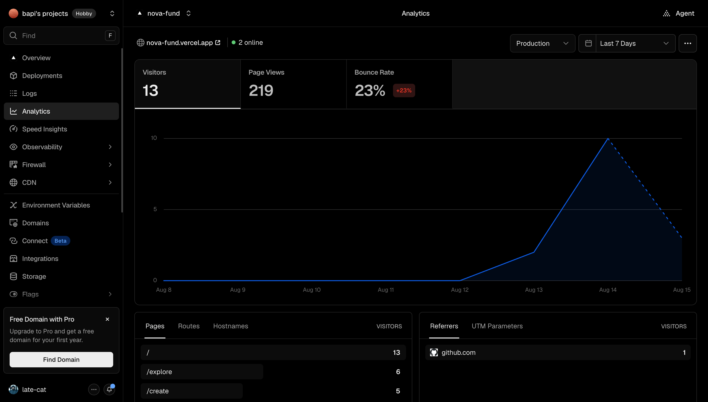

**Sentry Error Monitoring:**
Comprehensive crash reporting and performance monitoring configured for the production Next.js application, satisfying the Level 4 monitoring requirement.


#### 🔧 Level 4 Technical Additions

| Feature | Implementation |
| :--- | :--- |
| **Vercel Analytics** | `@vercel/analytics` integrated for page views, web vitals, and usage tracking |
| **Sentry Error Monitoring** | Sentry SDK integrated for production error tracking and crash reports |
| **Floating Feedback Button** | Persistent feedback prompt linking to user survey |
| **Global Error Boundary** | Custom React error boundaries to catch and recover from UI crashes |
| **Skeleton Loaders** | Themed pulsing skeleton loaders for campaigns and dashboards |
| **Responsive Mobile UI** | Dedicated mobile grid layouts ensuring 100% usability on phones |
| **Multi-Wallet Support** | Seamless connection using preferred Stellar wallets via StellarWalletsKit (Freighter, Albedo, xBull, Rabet) |

---

## 🏗️ High-Level System Architecture

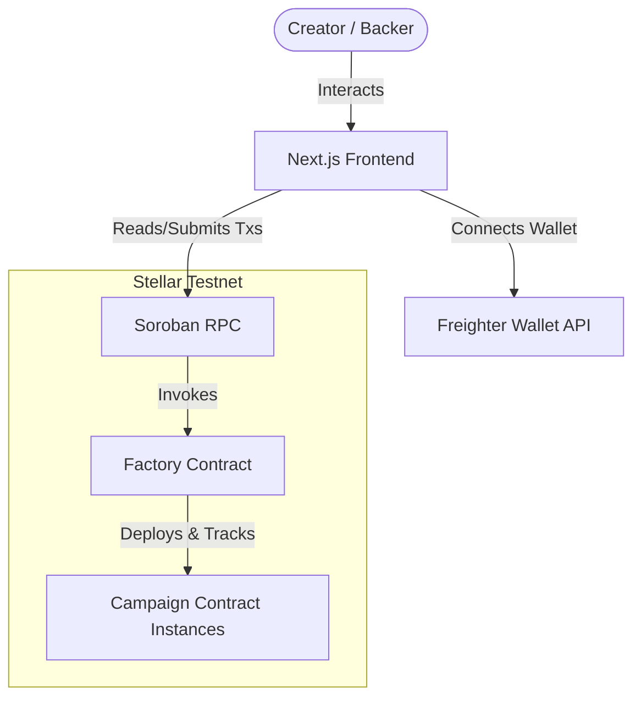
```mermaid
graph TD
    User([Creator / Backer]) -->|Interacts| UI[Next.js Frontend]
    UI -->|Connects Wallet| Freighter[Freighter Wallet API]
    UI -->|Reads/Submits Txs| RPC[Soroban RPC]
    
    subgraph Stellar Network [Stellar Testnet]
        RPC -->|Invokes| ContractA[Factory Contract]
        ContractA -->|Deploys & Tracks| ContractB[Campaign Contract Instances]
    end
```

---

## 🛡️ Contract Addresses & Verifiable Links

*   **Verifiable Live App**: [https://nova-fund.vercel.app/](https://nova-fund.vercel.app/)
*   **Factory Core Contract**: [`CBGNLTWENII3LYUUVFU7DKCXV4HQTEKJQEUWXJKVIMVNMQL7E2DP2MEM`](https://stellar.expert/explorer/testnet/contract/CBGNLTWENII3LYUUVFU7DKCXV4HQTEKJQEUWXJKVIMVNMQL7E2DP2MEM)
*   **Network**: Stellar Testnet
*   **Example Transaction Hash**: [`bc1af24298ffecf1b7d1d6367765570dba21c0e25e3b0531353485b61ce712ff48`](https://stellar.expert/explorer/testnet/tx/bc1af24298ffecf1b7d1d6367765570dba21c0e25e3b0531353485b61ce712ff48)
*   **Stellar Explorer Link**: [View on Stellar Expert](https://stellar.expert/explorer/testnet/tx/bc1af24298ffecf1b7d1d6367765570dba21c0e25e3b0531353485b61ce712ff48)

---

## 📸 Checkpoint Deliverables: Interface Showcase

### 🧰 Product UI: Exploring Ongoing Campaigns
*Browse through all active crowdfunding campaigns dynamically deployed via the Factory contract.*
<div align="center">
  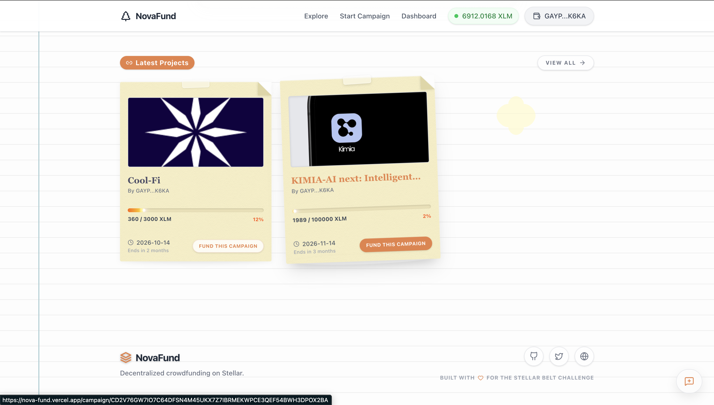
</div>

### 🚀 Product UI: Starting a New Campaign
*An intuitive dashboard for creating a new campaign. Connect your Freighter wallet to deploy a bespoke campaign contract on-chain.*
<details open>
<summary><b>Campaign Creation UI</b></summary>
<br>


</details>

### 💸 Product UI: Pledging & Confirming Transactions
*Backers can natively pledge XLM directly to the campaign contract. Freighter prompts the user for a secure, trustless signature.*
<details open>
<summary><b>Transaction Confirmation</b></summary>
<br>

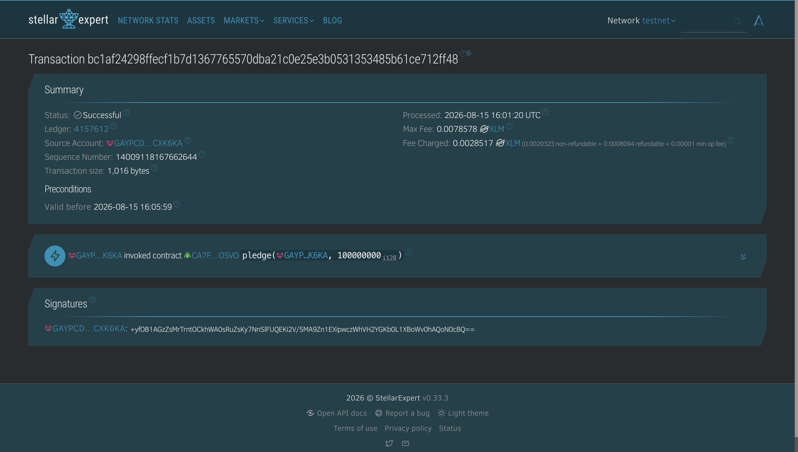
</details>

### 📊 Product UI: Live Funding Progress
*Real-time progress bars tracking XLM contributions towards the campaign target goal.*
<details open>
<summary><b>Funding Progress UI</b></summary>
<br>

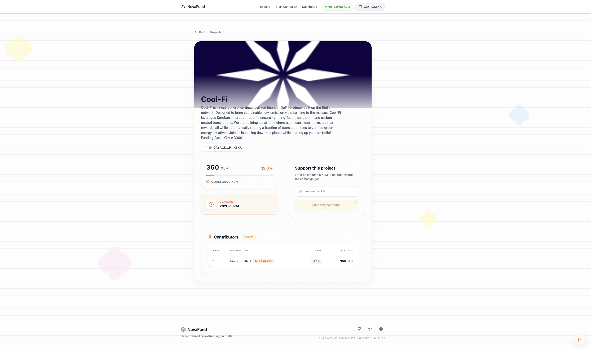
</details>

### ⚡ Product UI: On-Chain Transaction Success
*Every transaction is verified on the Stellar Expert Explorer, proving cryptographic immutability.*
<div align="center">
  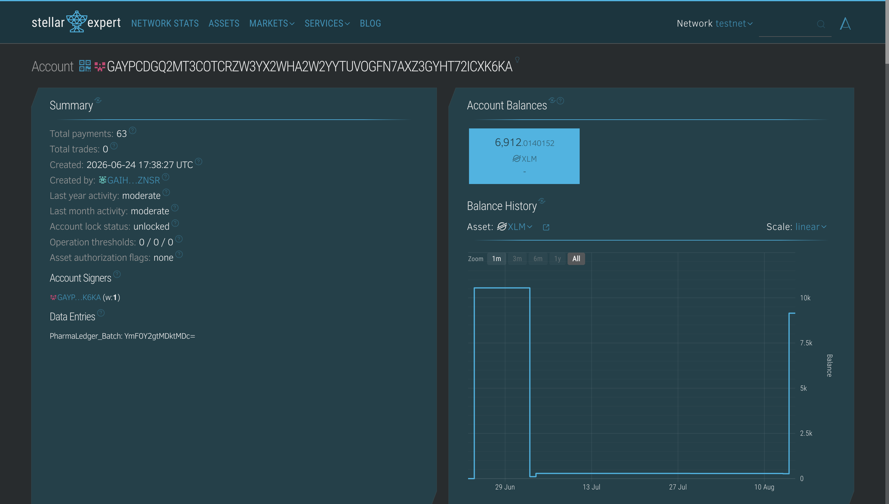
</div>

### 💼 Product UI: Multi-Wallet Support
*Seamlessly connect using your preferred Stellar wallet via StellarWalletsKit. We support Freighter, Albedo, xBull, HOT Wallet, and more out of the box.*
<div align="center">
  
</div>

### 📱 Mobile Responsive Design
*Our interface seamlessly adapts to any mobile device, ensuring backers can pledge on the go.*
<div style="display: flex; gap: 10px;">
  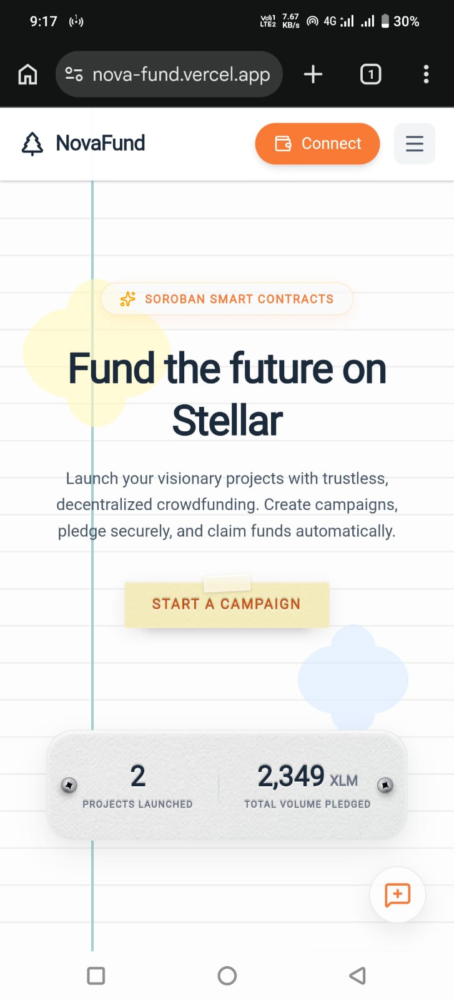
  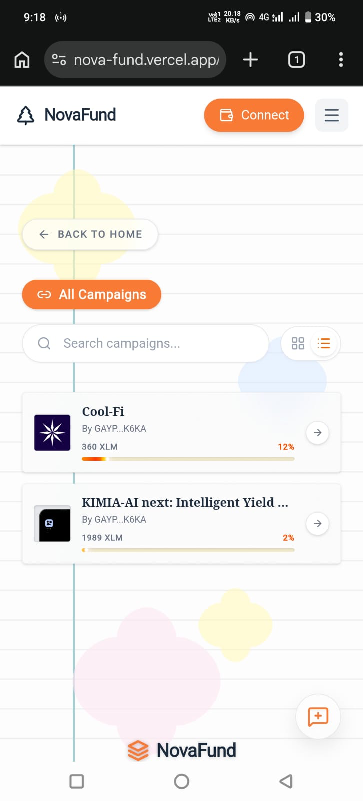
</div>

---

## 🛡️ Smart Contract Architecture & Validation

### Smart Contract Flow
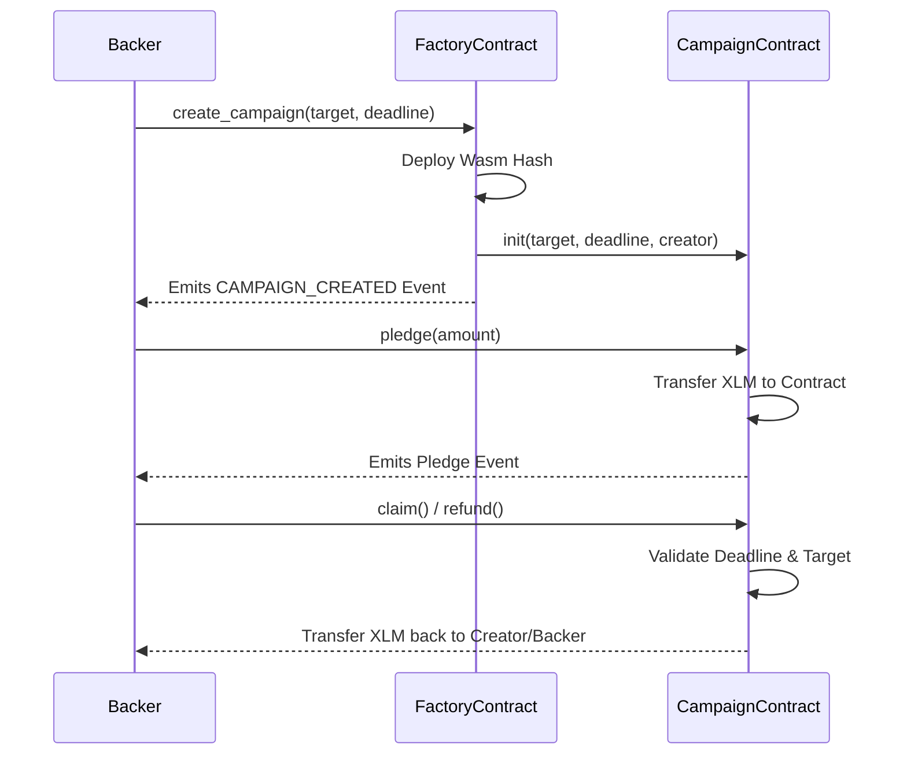
```mermaid
sequenceDiagram
    participant Backer
    participant FactoryContract
    participant CampaignContract
    
    Backer->>FactoryContract: create_campaign(target, deadline)
    FactoryContract->>FactoryContract: Deploy Wasm Hash
    FactoryContract->>CampaignContract: init(target, deadline, creator)
    FactoryContract-->>Backer: Emits CAMPAIGN_CREATED Event
    
    Backer->>CampaignContract: pledge(amount)
    CampaignContract->>CampaignContract: Transfer XLM to Contract
    CampaignContract-->>Backer: Emits Pledge Event
    
    Backer->>CampaignContract: claim() / refund()
    CampaignContract->>CampaignContract: Validate Deadline & Target
    CampaignContract-->>Backer: Transfer XLM back to Creator/Backer
```

### Verified Test Suite
*Running frontend Jest tests and smart contract Cargo tests successfully executes all edge cases perfectly:*

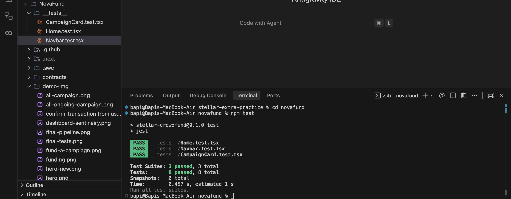

---

## ⚙️ Professional CI/CD Pipeline

Our GitHub Actions workflow automatically builds the Next.js frontend, compiles the Rust contracts to WebAssembly, and runs tests upon pushing commits to the main repository.

### ✅ Frontend & Smart Contract CI Success
*Detailed view of our CI pipeline successfully passing all checks:*
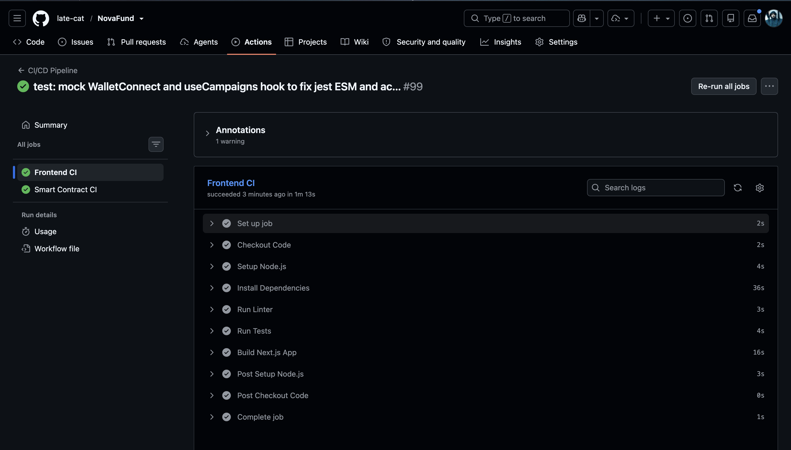

---

## 🛠️ Technology Stack
*   **Frontend**: Next.js 14 + TypeScript + Tailwind CSS + Framer Motion
*   **Contracts**: Rust (Soroban SDK `v27.0.0`)
*   **Stellar Integration**: Freighter API, Soroban RPC bindings
*   **Testing**: Cargo test for Rust contracts, Jest for Frontend
*   **Analytics**: Vercel Analytics, Sentry

---

## 📁 Project Structure
The repository is structured as a monorepo, cleanly separating the Rust smart contracts from the Next.js frontend application:

```text
NovaFund/
├── .github/workflows/       # GitHub Actions CI/CD pipelines
├── contracts/               # Soroban Smart Contracts (Rust)
│   ├── campaign/            # Individual campaign escrow logic
│   └── factory/             # Registry and dynamic deployment logic
├── src/                     # Next.js Web Application
│   ├── app/                 # App Router pages and global layouts
│   ├── components/          # Reusable UI components (Navbar, Cards, Modals)
│   └── lib/                 # Soroban utilities and XDR integrations
├── demo-img/                # Architecture diagrams and UI screenshots
└── package.json             # Frontend dependencies and scripts
```

---

## 💻 Local Installation & Getting Started

### 📋 Prerequisites
*   Node.js 18+
*   Cargo + Rust Toolchain (with `wasm32v1-none` target)
*   Soroban CLI
*   Freighter Wallet browser extension installed

### ⚙️ Environment Variables
Create a `.env.local` file in the root directory:
```env
NEXT_PUBLIC_STELLAR_NETWORK="TESTNET"
NEXT_PUBLIC_FACTORY_CONTRACT_ID="CBPZXCKCLDUM24BHNINPWQBEVJ5NFUTOQWIWMUJOE4SELLZF4UI4YEG6"
NEXT_PUBLIC_SENTRY_DSN="YOUR_SENTRY_DSN"
BLOB_STORE_ID="YOUR_VERCEL_BLOB_STORE_ID"
BLOB_READ_WRITE_TOKEN="YOUR_VERCEL_BLOB_TOKEN"
```

**Note on Image Uploads:** To enable the image file upload feature for campaigns, you must create a [Vercel Blob](https://vercel.com/docs/storage/vercel-blob) store via your Vercel Dashboard. Ensure the store is set to **Public** access, and copy the generated `BLOB_STORE_ID` and `BLOB_READ_WRITE_TOKEN` into your environment variables.

### 🛠️ Step-by-Step Setup

1. **Clone the Repository**:
   ```bash
   git clone https://github.com/late-cat/NovaFund.git
   cd NovaFund
   ```

2. **Install Frontend Dependencies**:
   ```bash
   npm install
   ```

3. **Run the Development Server**:
   ```bash
   npm run dev
   ```

4. **Run the Smart Contract Tests**:
   ```bash
   cd contracts
   cargo test
   ```

5. **Deploy the Smart Contracts**:
   Configure your Soroban CLI with a funded Testnet identity, then build and deploy targeting `wasm32v1-none`:
   ```bash
   cd contracts
   cargo build -p campaign --target wasm32v1-none --release
   cargo build -p factory --target wasm32v1-none --release
   # Use soroban-cli to install campaign and deploy factory
   ```

---

## 🔒 Security Considerations

- **Factory Deployment**: Campaign contracts are strictly deployed through the Factory, ensuring verified code execution and preventing rogue logic.
- **Trustless Escrow**: XLM pledges are locked directly within the Soroban contract state, eliminating centralized custody.
- **Refund Guarantees**: If a campaign fails to meet its target by the deadline, backers are algorithmically guaranteed the ability to claim refunds without relying on the creator.
- **Wallet Security**: Uses the Freighter API to ensure private keys never touch the DOM or React state. All signing is delegated entirely to the secure wallet extension.

---

<div align="center">
  <b>Developed with ⚔️ by Bapi Mondal</b><br>
  <a href="https://github.com/late-cat">GitHub Profile</a>
</div>
