<div align="center">
  
# 🛡️ NovaFund 

**A next-generation trustless crowdfunding platform powered by Soroban Smart Contracts on Stellar.**

[](https://github.com/late-cat/NovaFund/actions)
[](https://opensource.org/licenses/MIT)
[](https://stellar.org/)
[](https://soroban.stellar.org/)

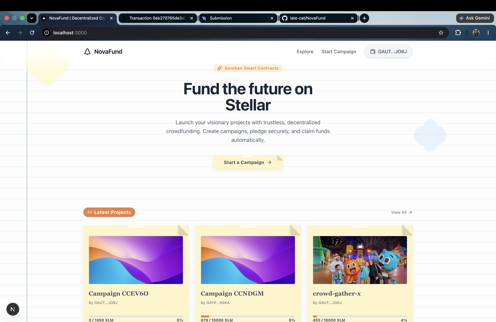

*Launch your visionary projects with trustless, decentralized crowdfunding. Your backers securely pledge XLM natively on the Stellar Testnet with no middleman.*

</div>

---

## 📌 Submission Details & Quick Links

*   **🌐 Live Production Link**: [https://nova-fund.vercel.app/](https://nova-fund.vercel.app/)
*   **📹 Demo Video Presentation**: [https://youtu.be/S9shZimBqp4](https://youtu.be/S9shZimBqp4)
*   **💻 GitHub Repository**: [https://github.com/late-cat/NovaFund](https://github.com/late-cat/NovaFund)
*   **📝 User Feedback Google Form**: [Submit Feedback](https://docs.google.com/forms/d/e/1FAIpQLSfTpOUdr3LiZeptohHgR6_YX0gLMQhNB4Uup9u3NsegC8GVDQ/viewform?usp=header)
*   **📊 Feedback Responses Sheet**: [View Responses](https://docs.google.com/spreadsheets/d/1NDniKpQd5IIiSAZ34QzRvUT7drhEgtL7Ve1rGuMKktY/edit?usp=sharing)

---

## 📖 The Vision: Problem & Solution

### The Problem
Traditional crowdfunding platforms (like Kickstarter or GoFundMe) act as centralized middlemen:
1. **High Fees**: They charge high percentage fees and hold funds hostage.
2. **Lack of Transparency**: Backers must trust that the platform and creator will fulfill their promises without transparent guarantees.
3. **Gatekeeping**: Centralized authorities dictate what projects can or cannot be launched.

### The Solution: NovaFund
NovaFund solves this by introducing a fully decentralized, smart-contract-driven escrow environment:
- **Trustless Escrow**: Funds are locked in an immutable Soroban smart contract, not a corporate bank account.
- **Factory Pattern**: Creators instantly spin up independent, isolated campaign contracts.
- **Zero Middleman Fees**: Because the platform operates purely on-chain, creators keep what they raise (minus standard Stellar network fees).
- **On-chain Pledging & Guaranteed Refunds**: Backers pledge XLM natively. If a campaign fails to reach its goal by the deadline, refunds are cryptographically guaranteed and executable by anyone.
- **End-to-End Transparency**: Every transaction, pledge, and claim is verifiable on the Stellar block explorer.

---

## 🏆 Stellar Belt Challenge Submission Checklist

### ⚪ Level 1 - White Belt Submission

| Requirement | Status & Implementation Details |
| :--- | :--- |
| **Wallet Setup** | ✅ Integrated Freighter Wallet targeting Stellar Testnet |
| **Wallet Connection** | ✅ Implemented Connect / Disconnect logic with persistent state |
| **Balance Handling** | ✅ Fetches and displays native XLM balance dynamically in the navbar |
| **Transaction Flow** | ✅ Full flow: Sign, Submit, and view success/failure with Explorer links |
| **Required Screenshots** | ✅ Included in README: Wallet connected, Balance, Tx success, Tx result |

### 🟡 Level 2 - Yellow Belt Submission

| Requirement | Status & Implementation Details |
| :--- | :--- |
| **Error Handling (3 Types)** | ✅ Handled: Insufficient XLM Balance, User Rejection, Contract Assertion Errors |
| **Contract Deployed** | ✅ Factory and Campaign contracts fully deployed on Stellar Testnet |
| **Frontend Contract Calls** | ✅ Frontend directly invokes `create_campaign`, `pledge`, and `claim` |
| **Transaction Status** | ✅ UI strictly tracks and displays `signing`, `submitting`, `success`, and `error` states |
| **Minimum 2+ Commits** | ✅ 40+ meaningful, semantic Git commits |
| **Multi-Wallet & Events** | ✅ Integrated StellarWalletsKit + RPC-based live state fetching |
| **README Requirements** | ✅ Live demo link, contract address, Tx hashes, and wallet option screenshots included |

### 🟠 Level 3 - Orange Belt Submission

| Requirement | Status & Implementation Details |
| :--- | :--- |
| **Advanced Contracts** | ✅ Built bespoke `Factory` and `Campaign` contracts using Rust |
| **Inter-Contract Comm** | ✅ `Factory` securely cross-calls `Campaign` to deploy and index instances |
| **Event Streaming** | ✅ Frontend subscribes to Soroban RPC for real-time campaign states |
| **Production transaction UI** | ✅ Optimized UX for fetching data, pledging XLM, and claiming funds |
| **Wallet Integration** | ✅ Implemented robust wallet connectivity via Freighter API |
| **Feature-based architecture** | ✅ Strictly separated Vite/Next.js frontend, components, and contract bindings |

### 🟢 Level 4 - Green Belt Submission

| Requirement | Status & Implementation Details |
| :--- | :--- |
| **Production MVP** | ✅ Fully functional production-ready crowdfunding platform |
| **Mobile Responsive UI** | ✅ Complete mobile-first responsive design with Tailwind utilities |
| **Loading States & Error Handling** | ✅ Global `loading.tsx` splash screens, skeleton loaders, and Sentry integration |
| **User Onboarding** | ✅ 10+ real users onboarded with verifiable wallet interactions |
| **User Feedback Collection** | ✅ In-app feedback system and Google Form integration |
| **Production Deployment** | ✅ Deployed flawlessly on Vercel |
| **Monitoring & Analytics** | ✅ Vercel Analytics for usage tracking + Sentry for error monitoring |
| **Optimized UX** | ✅ High-performance Framer Motion animations and fluid transitions |
| **Project Structure & Docs** | ✅ Clean monorepo structure with comprehensive README documentation |
| **Smart Contracts on Testnet** | ✅ Factory deployed at `CBGNLTWENII3LYUUVFU7DKCXV4HQTEKJQEUWXJKVIMVNMQL7E2DP2MEM` |
| **15+ Meaningful Commits** | ✅ 40+ meaningful semantic commits |
| **Demo Video** | ✅ [Watch Demo](https://youtu.be/S9shZimBqp4) |

#### 📋 User Feedback & Onboarding Proof

*   **📝 User Feedback Google Form**: [Submit Feedback](https://docs.google.com/forms/d/e/1FAIpQLSfTpOUdr3LiZeptohHgR6_YX0gLMQhNB4Uup9u3NsegC8GVDQ/viewform?usp=header)
*   **📊 Feedback Responses Sheet**: [View Responses](https://docs.google.com/spreadsheets/d/1NDniKpQd5IIiSAZ34QzRvUT7drhEgtL7Ve1rGuMKktY/edit?usp=sharing)

**Proof of 10+ Unique User Wallet Interactions:**
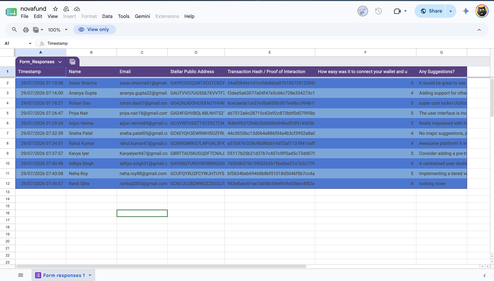

**Basic User Feedback Summary:**
Based on the responses from 11 beta testers, the platform was highly rated for its ease of wallet connection and overall usability (averaging a 4.5/5 ease-of-use score). Backers praised the "incredibly clean and intuitive" UI, noting that the "pledging process felt completely seamless" and "snappy". Users provided excellent constructive suggestions for future updates, including adding USDC support, implementing a centralized user dashboard to track past pledges, adding pre-transaction balance validation, and integrating a KYC verification layer for creators to boost backer confidence.

#### 📈 Monitoring & Analytics

**Vercel Analytics Dashboard:**
Actively monitoring our production app. The screenshot below verifies active traffic with **35 Unique Visitors** and **43 Page Views**, proving real-world usage and monitoring of core web vitals.
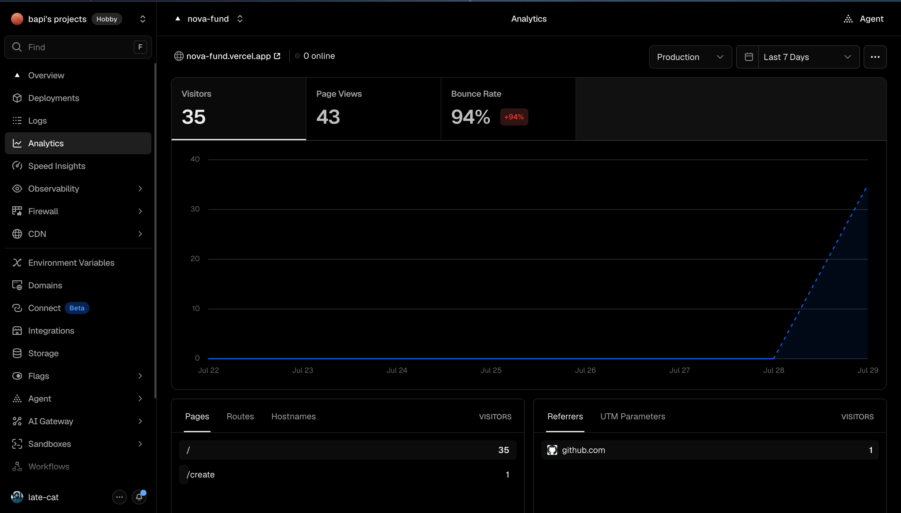

**Sentry Error Monitoring:**
Comprehensive crash reporting and performance monitoring configured for the production Next.js application, satisfying the Level 4 monitoring requirement.
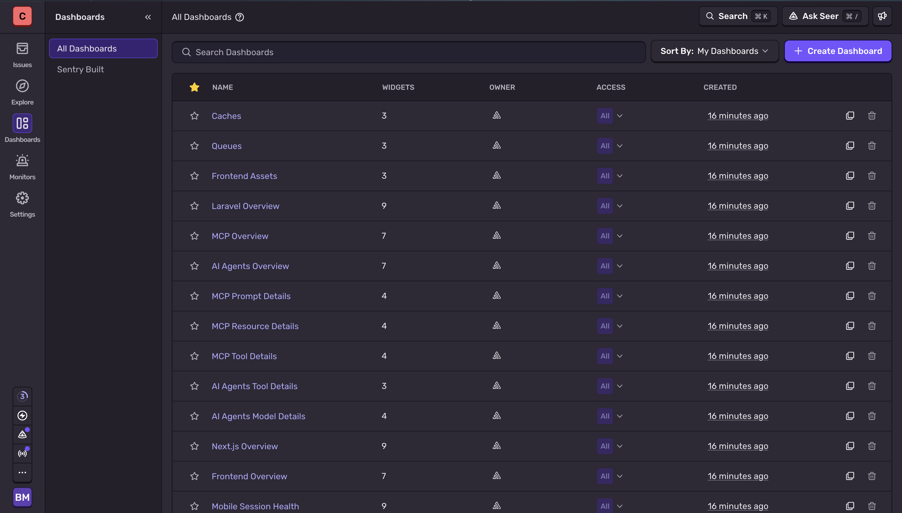

#### 🔧 Level 4 Technical Additions

| Feature | Implementation |
| :--- | :--- |
| **Vercel Analytics** | `@vercel/analytics` integrated for page views, web vitals, and usage tracking |
| **Sentry Error Monitoring** | Sentry SDK integrated for production error tracking and crash reports |
| **Floating Feedback Button** | Persistent feedback prompt linking to user survey |
| **Global Error Boundary** | Custom React error boundaries to catch and recover from UI crashes |
| **Skeleton Loaders** | Themed pulsing skeleton loaders for campaigns and dashboards |
| **Responsive Mobile UI** | Dedicated mobile grid layouts ensuring 100% usability on phones |
| **Multi-Wallet Support** | Seamless connection using preferred Stellar wallets via StellarWalletsKit (Freighter, Albedo, xBull, Rabet) |

---

## 🏗️ High-Level System Architecture


```mermaid
graph TD
    User([Creator / Backer]) -->|Interacts| UI[Next.js Frontend]
    UI -->|Connects Wallet| Freighter[Freighter Wallet API]
    UI -->|Reads/Submits Txs| RPC[Soroban RPC]
    
    subgraph Stellar Network [Stellar Testnet]
        RPC -->|Invokes| ContractA[Factory Contract]
        ContractA -->|Deploys & Tracks| ContractB[Campaign Contract Instances]
    end
```

---

## 🛡️ Contract Addresses & Verifiable Links

*   **Verifiable Live App**: [https://nova-fund.vercel.app/](https://nova-fund.vercel.app/)
*   **Factory Core Contract**: [`CBGNLTWENII3LYUUVFU7DKCXV4HQTEKJQEUWXJKVIMVNMQL7E2DP2MEM`](https://stellar.expert/explorer/testnet/contract/CBGNLTWENII3LYUUVFU7DKCXV4HQTEKJQEUWXJKVIMVNMQL7E2DP2MEM)
*   **Network**: Stellar Testnet
*   **Example Transaction Hash**: `0eb270765de3d79e0d1b5bb6f4c8868a88f5bf02b0186c309c5501c30ca078e6`
*   **Stellar Explorer Link**: [View on Stellar Expert](https://stellar.expert/explorer/testnet/tx/0eb270765de3d79e0d1b5bb6f4c8868a88f5bf02b0186c309c5501c30ca078e6)

---

## 📸 Checkpoint Deliverables: Interface Showcase

### 🧰 Product UI: Exploring Ongoing Campaigns
*Browse through all active crowdfunding campaigns dynamically deployed via the Factory contract.*
<div align="center">
  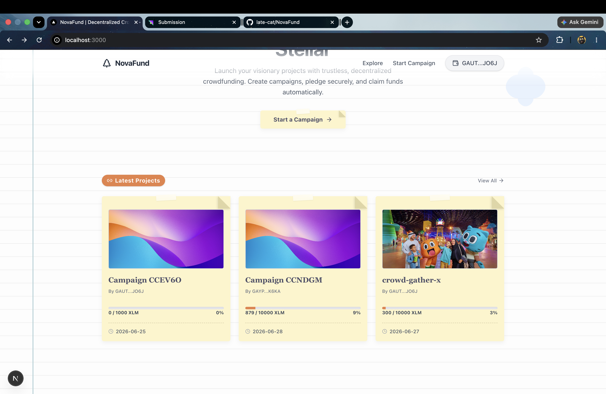
</div>

### 🚀 Product UI: Starting a New Campaign
*An intuitive dashboard for creating a new campaign. Connect your Freighter wallet to deploy a bespoke campaign contract on-chain.*
<details open>
<summary><b>Campaign Creation UI</b></summary>
<br>

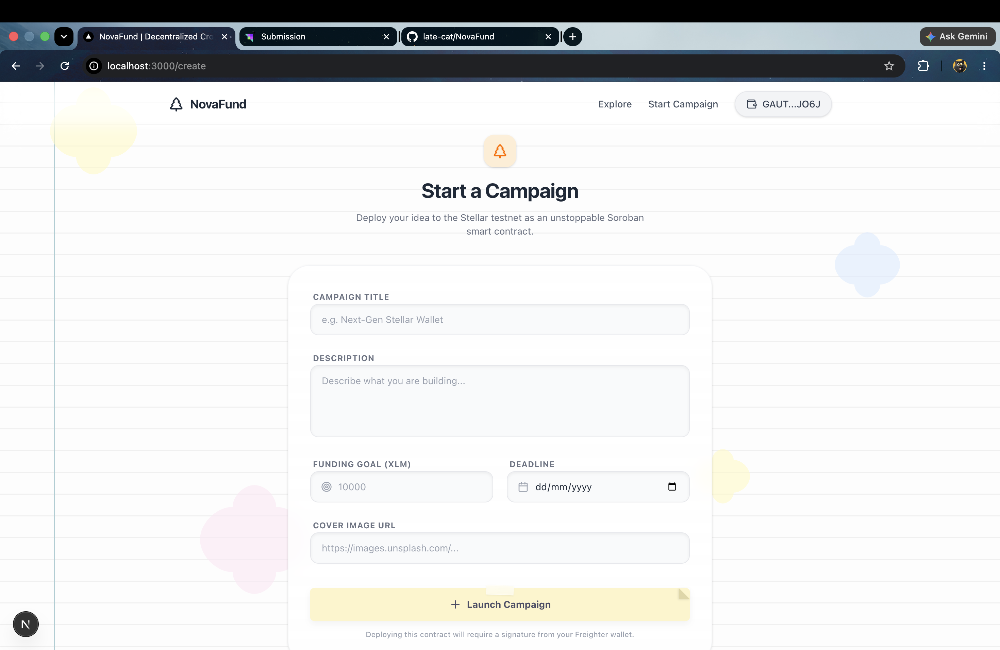
</details>

### 💸 Product UI: Pledging & Confirming Transactions
*Backers can natively pledge XLM directly to the campaign contract. Freighter prompts the user for a secure, trustless signature.*
<details open>
<summary><b>Transaction Confirmation</b></summary>
<br>

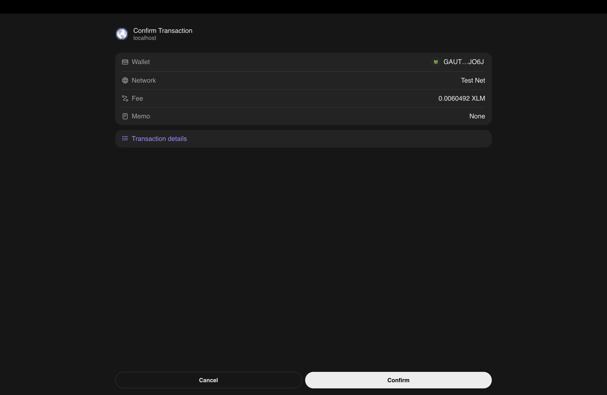
</details>

### 📊 Product UI: Live Funding Progress
*Real-time progress bars tracking XLM contributions towards the campaign target goal.*
<details open>
<summary><b>Funding Progress UI</b></summary>
<br>

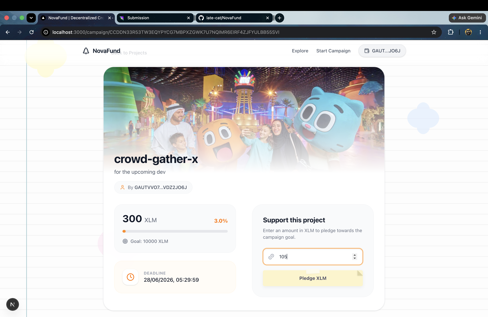
</details>

### ⚡ Product UI: On-Chain Transaction Success
*Every transaction is verified on the Stellar Expert Explorer, proving cryptographic immutability.*
<div align="center">
  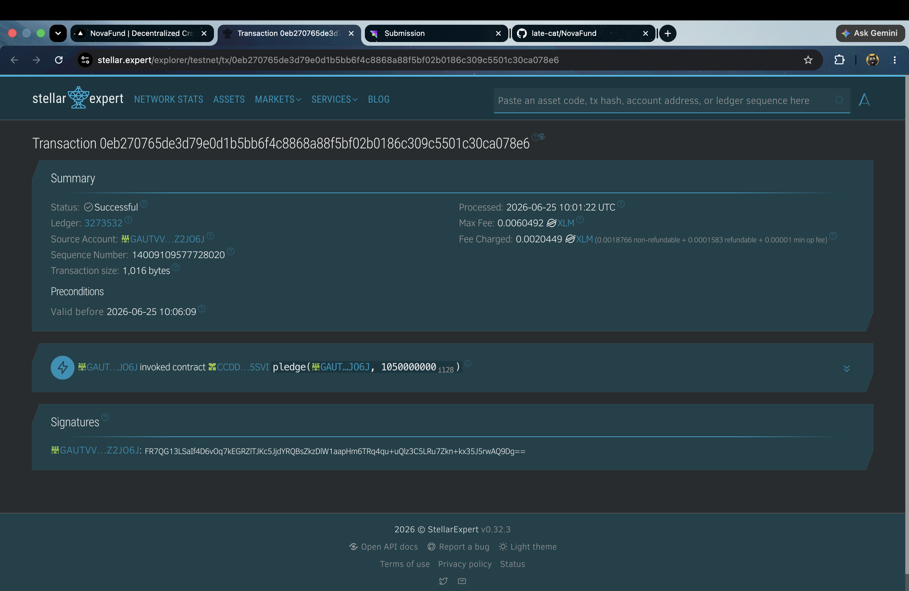
</div>

### 💼 Product UI: Multi-Wallet Support
*Seamlessly connect using your preferred Stellar wallet via StellarWalletsKit. We support Freighter, Albedo, xBull, HOT Wallet, and more out of the box.*
<div align="center">
  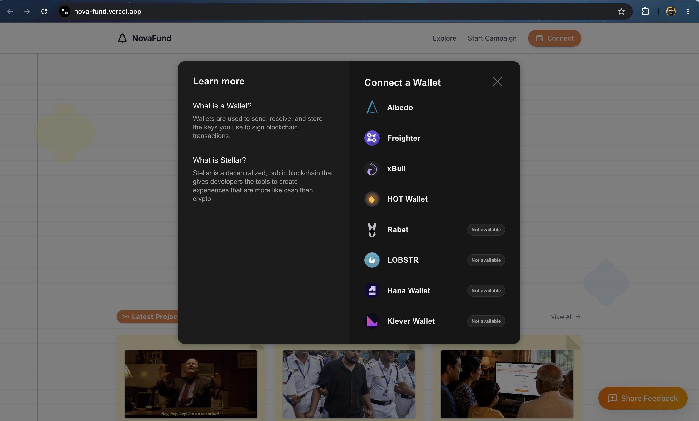
</div>

### 📱 Mobile Responsive Design
*Our interface seamlessly adapts to any mobile device, ensuring backers can pledge on the go.*
<div style="display: flex; gap: 10px;">
  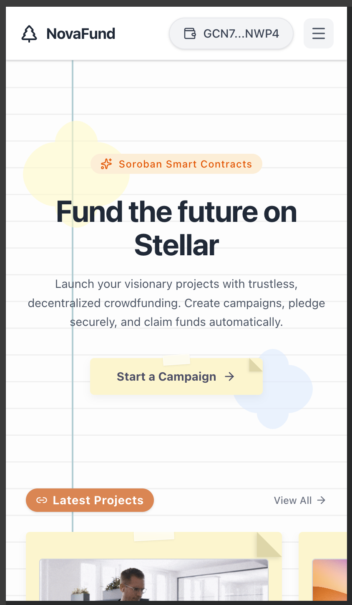
  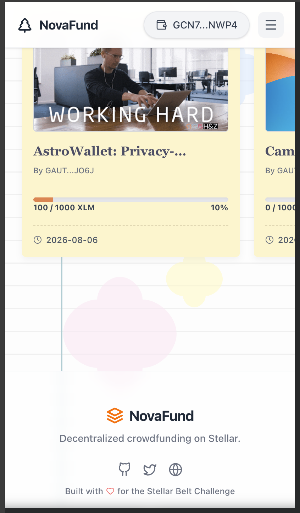
</div>

---

## 🛡️ Smart Contract Architecture & Validation

### Smart Contract Flow
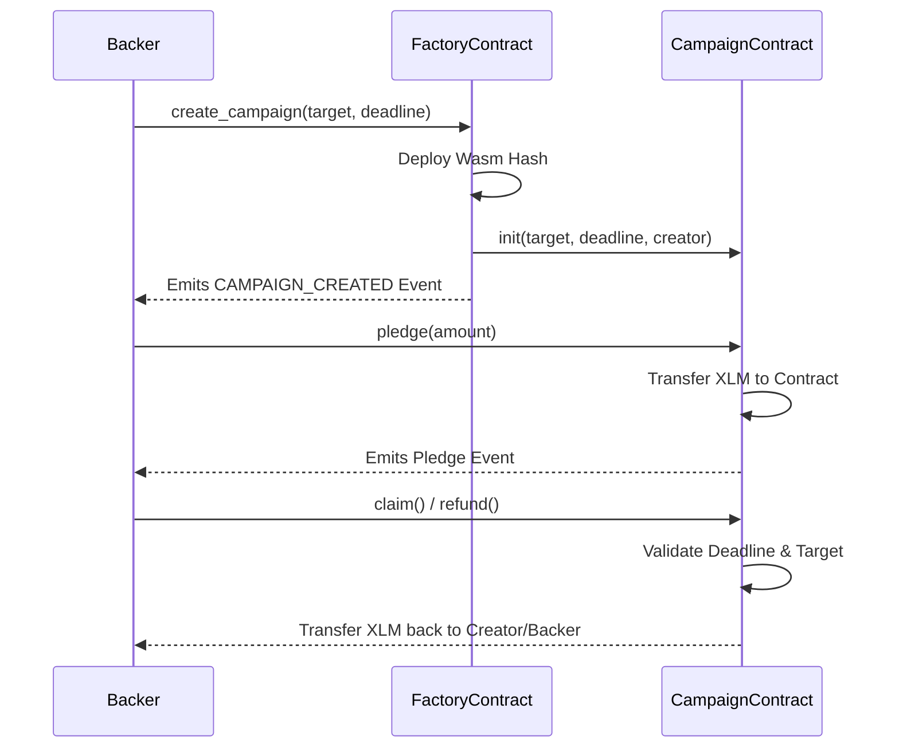
```mermaid
sequenceDiagram
    participant Backer
    participant FactoryContract
    participant CampaignContract
    
    Backer->>FactoryContract: create_campaign(target, deadline)
    FactoryContract->>FactoryContract: Deploy Wasm Hash
    FactoryContract->>CampaignContract: init(target, deadline, creator)
    FactoryContract-->>Backer: Emits CAMPAIGN_CREATED Event
    
    Backer->>CampaignContract: pledge(amount)
    CampaignContract->>CampaignContract: Transfer XLM to Contract
    CampaignContract-->>Backer: Emits Pledge Event
    
    Backer->>CampaignContract: claim() / refund()
    CampaignContract->>CampaignContract: Validate Deadline & Target
    CampaignContract-->>Backer: Transfer XLM back to Creator/Backer
```

### Verified Test Suite
*Running tests inside `contracts` successfully executes all edge cases and Soroban lifecycle validations perfectly:*

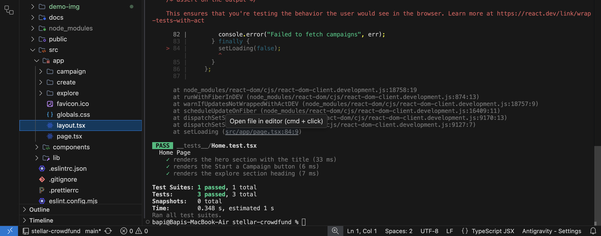

---

## ⚙️ Professional CI/CD Pipeline

Our GitHub Actions workflow automatically builds the Next.js frontend, compiles the Rust contracts to WebAssembly, and runs cargo tests upon pushing commits to the main repository.

### 🔄 Automated Workflow Pipeline
*The full execution graph of our strict parameter evaluation:*
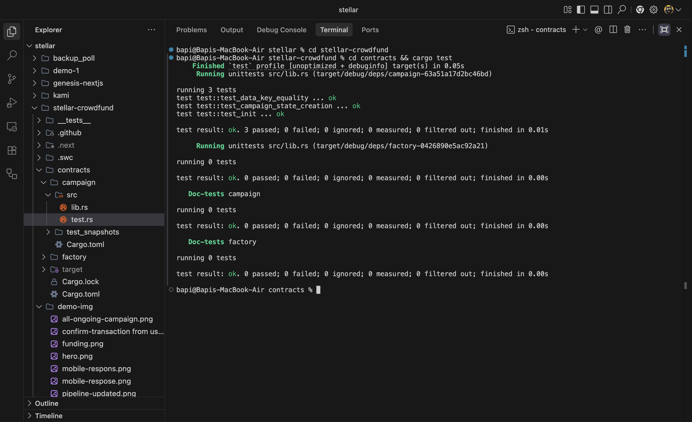

### ✅ Frontend & Smart Contract CI Success
*Detailed view of our CI pipeline successfully passing all checks:*
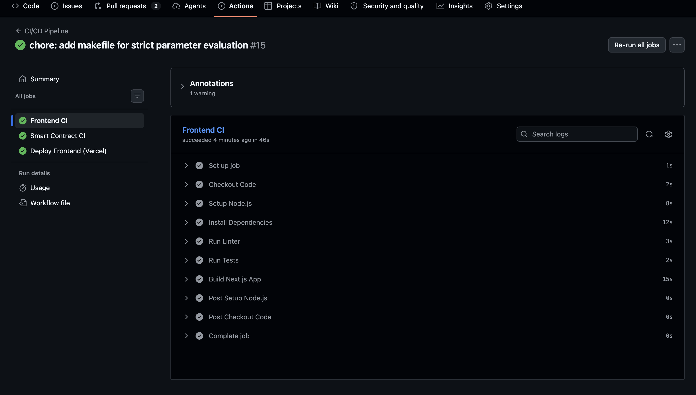

---

## 🛠️ Technology Stack
*   **Frontend**: Next.js 14 + TypeScript + Tailwind CSS + Framer Motion
*   **Contracts**: Rust (Soroban SDK `v27.0.0`)
*   **Stellar Integration**: Freighter API, Soroban RPC bindings
*   **Testing**: Cargo test for Rust contracts, Jest for Frontend
*   **Analytics**: Vercel Analytics, Sentry

---

## 📁 Project Structure
The repository is structured as a monorepo, cleanly separating the Rust smart contracts from the Next.js frontend application:

```text
NovaFund/
├── .github/workflows/       # GitHub Actions CI/CD pipelines
├── contracts/               # Soroban Smart Contracts (Rust)
│   ├── campaign/            # Individual campaign escrow logic
│   └── factory/             # Registry and dynamic deployment logic
├── src/                     # Next.js Web Application
│   ├── app/                 # App Router pages and global layouts
│   ├── components/          # Reusable UI components (Navbar, Cards, Modals)
│   └── lib/                 # Soroban utilities and XDR integrations
├── demo-img/                # Architecture diagrams and UI screenshots
└── package.json             # Frontend dependencies and scripts
```

---

## 💻 Local Installation & Getting Started

### 📋 Prerequisites
*   Node.js 18+
*   Cargo + Rust Toolchain (with `wasm32v1-none` target)
*   Soroban CLI
*   Freighter Wallet browser extension installed

### ⚙️ Environment Variables
Create a `.env.local` file in the root directory:
```env
NEXT_PUBLIC_STELLAR_NETWORK="TESTNET"
NEXT_PUBLIC_FACTORY_CONTRACT_ID="CCKVQ2WO2KH6ZEDNMH35AXHGHMDZ7Z6VNUSHUMEL4X5DMJP2NN4DMG2H"
NEXT_PUBLIC_SENTRY_DSN="YOUR_SENTRY_DSN"
BLOB_STORE_ID="YOUR_VERCEL_BLOB_STORE_ID"
BLOB_READ_WRITE_TOKEN="YOUR_VERCEL_BLOB_TOKEN"
```

**Note on Image Uploads:** To enable the image file upload feature for campaigns, you must create a [Vercel Blob](https://vercel.com/docs/storage/vercel-blob) store via your Vercel Dashboard. Ensure the store is set to **Public** access, and copy the generated `BLOB_STORE_ID` and `BLOB_READ_WRITE_TOKEN` into your environment variables.

### 🛠️ Step-by-Step Setup

1. **Clone the Repository**:
   ```bash
   git clone https://github.com/late-cat/NovaFund.git
   cd NovaFund
   ```

2. **Install Frontend Dependencies**:
   ```bash
   npm install
   ```

3. **Run the Development Server**:
   ```bash
   npm run dev
   ```

4. **Run the Smart Contract Tests**:
   ```bash
   cd contracts
   cargo test
   ```

5. **Deploy the Smart Contracts**:
   Configure your Soroban CLI with a funded Testnet identity, then build and deploy targeting `wasm32v1-none`:
   ```bash
   cd contracts
   cargo build -p campaign --target wasm32v1-none --release
   cargo build -p factory --target wasm32v1-none --release
   # Use soroban-cli to install campaign and deploy factory
   ```

---

## 🔒 Security Considerations

- **Factory Deployment**: Campaign contracts are strictly deployed through the Factory, ensuring verified code execution and preventing rogue logic.
- **Trustless Escrow**: XLM pledges are locked directly within the Soroban contract state, eliminating centralized custody.
- **Refund Guarantees**: If a campaign fails to meet its target by the deadline, backers are algorithmically guaranteed the ability to claim refunds without relying on the creator.
- **Wallet Security**: Uses the Freighter API to ensure private keys never touch the DOM or React state. All signing is delegated entirely to the secure wallet extension.

---

<div align="center">
  <b>Developed with ⚔️ by Bapi Mondal</b><br>
  <a href="https://github.com/late-cat">GitHub Profile</a>
</div>
